# TJU-Automat 天大简易选课脚本

1.clone/下载本repo, 登录账号进入选课页面 

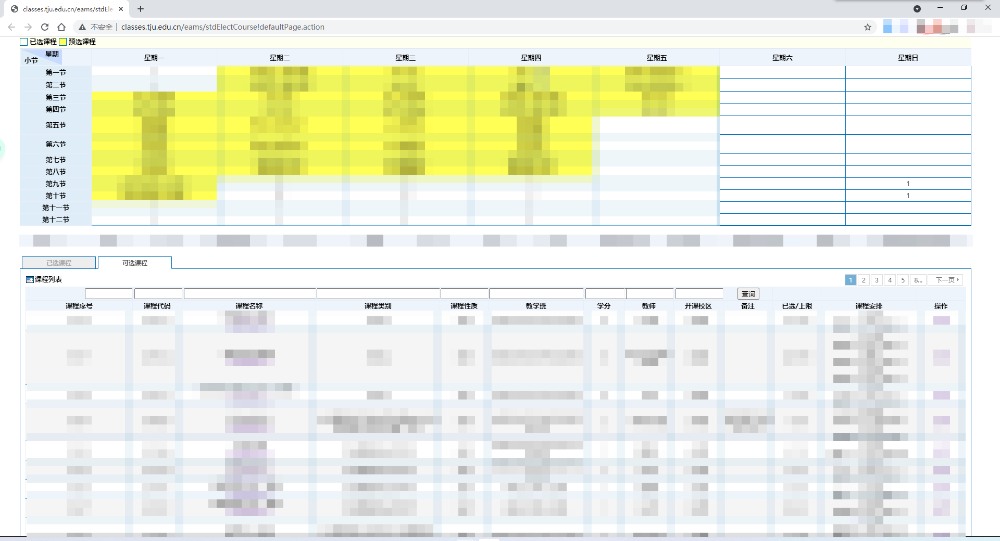

2.在该网页F12或者右键-\>检查/审查元素等类似操作，将上边栏切换到网络/Network选项卡

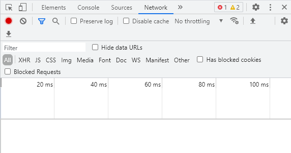

3.对要选的课进行选课操作，无须在意结果是成功、失败或者不在选课时间内

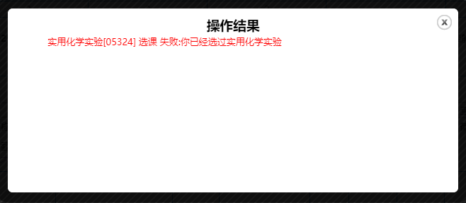

4.在刚才的选项卡中会出现一个(可能)std打头的，单击展开它

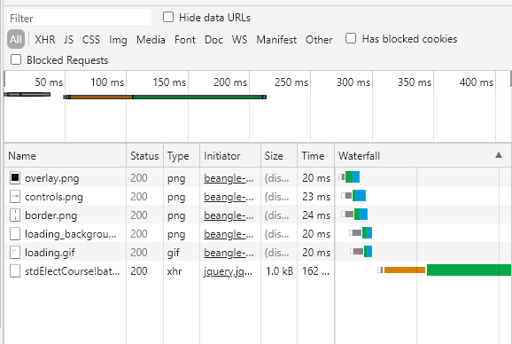

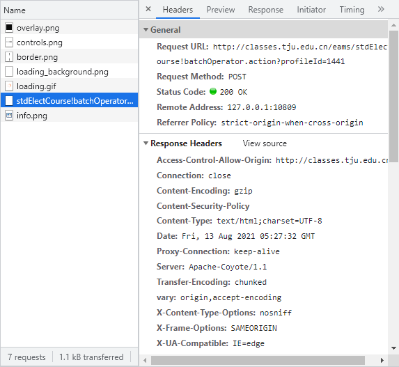

5.在右侧栏中找到请求URL/Request URL, 观察内容与config.txt/config内第一行是否相同, 不同则替换(不要打开自动换行)

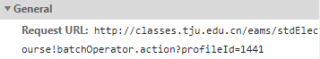

6.在右侧栏中找到表单数据/From Data的前几位数字，复制到config.txt/config内第一行(注意不要打开自动换行)

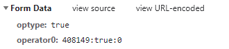

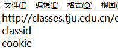
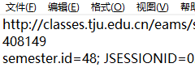

7.在右侧栏中找到cookie并右键-\>复制值/Copy Value，粘贴到config.txt/config内第二行(注意不要打开自动换行)，保存config.txt/config

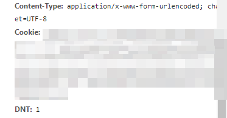

8.双击run.bat/run运行脚本

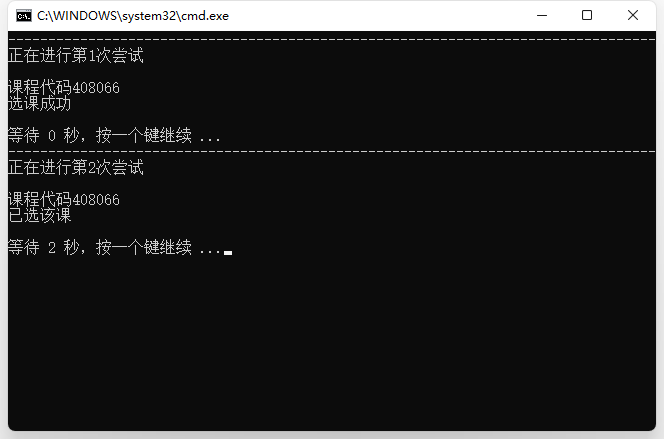
